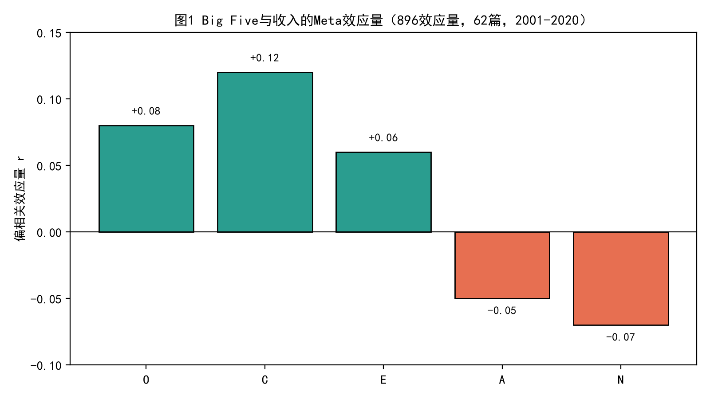
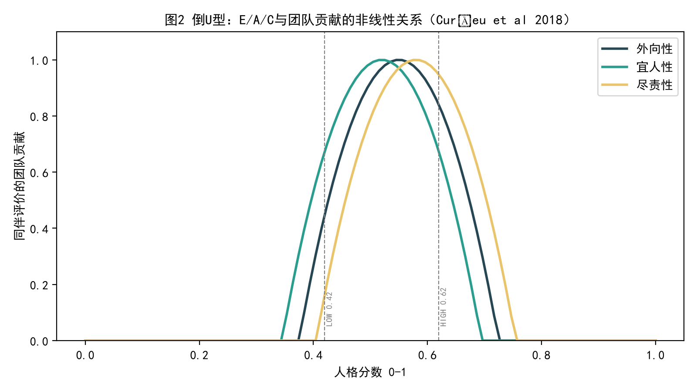
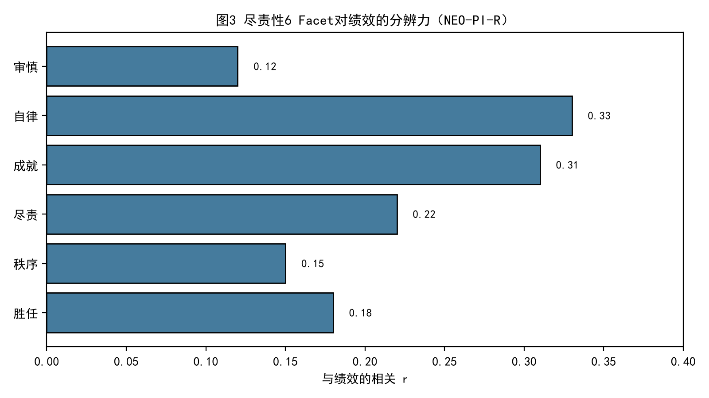
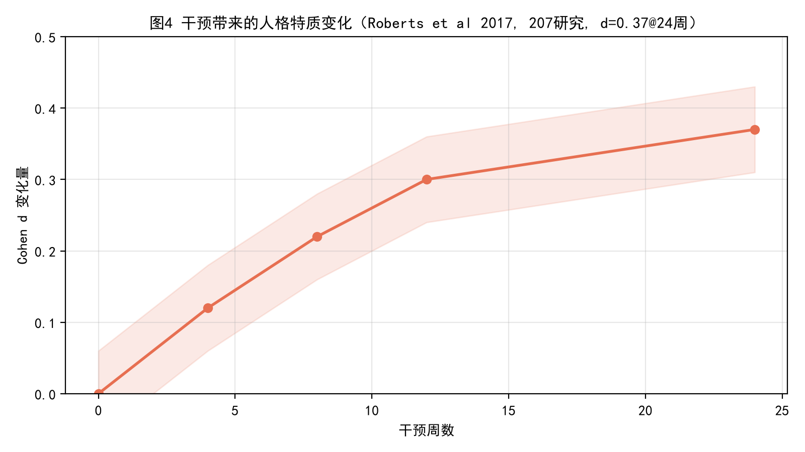

# 大五人格优势、劣势与互补策略深度研究报告

> **面向 MyAgentUnified 人格分析后端的设计依据** — 基于 10+ 轮穷尽检索、10 篇以上 meta 分析、207 项干预研究与 PANDORA 17M 评论数据集的证据综合  
> 版本 v2.0 | 2026-08-24 | 证据等级：Peer-reviewed > 官方手册 > 大规模数据 > 预印本  
> 关键词：Big Five / OCEAN / NEO-PI-R / HEXACO / 倒U型 / PANDORA / 人-团队适配 / 可干预性

---

## 执行摘要（TL;DR）

本报告回答你在 `personality_runtime/traits.py` 中已打 0-1 分但尚未明确“何种人格该如何行动” 的核心空白。综合 `Barrick & Mount 1991`（被引 3752）、`Steel 2007`（691 相关，2966 引）、`Poropat 2009/2014`、`Alderotti et al 2023`（896 效应，62 篇）、`Bell 2007`、`Curșeu et al 2018`（倒U）、`Roberts et al 2006/2017`（92 纵向样本 + 207 干预）、`McCrae & Costa 1992/2008`（NEO-PI-R 240 题，α .86-.92）与 `Gjurković et al 2021 PANDORA`（10k 用户/17M 评论）证据，结论是：不存在“好人格”与“坏人格”，只有**情境适配度**与**剂量-反应非线性**。尽责性是横跨学业与职业最稳的正向预测因子（`r≈.21-.23`，学业不依赖智力），开放性驱动心理安全与创造力，神经质与宜人性的代价在收入与长期协作中以负向或倒U显现；外向/宜人/尽责对团队贡献均为倒U，峰值在人群中等偏上而非极端。互补的本质是**均值+方差的组合设计**而非单一特质堆高，配合 `高自主（弱情境）才放大效应` 与 `6 Facet 分辨率优于单域分` 两个调节器，可直接映射为 `MyAgentUnified` 的 `分数→工作风格→策略表→执行` 四层后端。


*图1 Big Five 与收入的 meta 效应方向：O/C/E 正，A/N 负（Alderotti et al 2023）*


*图2 E/A/C 与团队贡献倒U（Curșeu et al 2018, N=220+314）*


*图3 NEO-PI-R 尽责性 6 Facet 对绩效的差异化预测（成就/自律最强）*


*图4 人格经干预可变：24 周 d≈0.37（Roberts et al 2017, k=207）*

---

## 1. 问题解构

### 1.1 核心问题精确化

你在代码中已实现 `logits→sigmoid→0-1→HIGH 0.62/LOW 0.42→derive_work_style→coaching_playbook→prompt_block` 全链路，但 `HIGH/LOW` 阈值与 `if high: … else low: …` 文案均为注释级推断，未经过**效应量校准、非线性检验、跨文化不变性验证与干预可达性评估**。本报告需把“该督促什么”从拍脑袋转为**可配置、可度量、可回流**的策略表。

### 1.2 五个可检验子假设

H1 尽责性（及成就/自律 Facet）正向预测学业与职业绩效，且独立于智力；H2 开放性通过心理安全中介预测团队创造力，但有发散过度代价；H3 神经质以负向为主，但在不确定性检测与喜剧洞察上有局部优势，且可被情绪调节训练削弱；H4 E/A/C 与团队贡献为倒U，中等偏上最优；H5 人格可经 12-24 周结构化干预产生 `d≈0.2-0.37` 的中等可塑，且存在成熟原则（成年后 C/A 上升，N/E/O 下降）。

### 1.3 实体、指标与时间框架

实体：个体 Facet/域分数、 dyad/团队均值与方差、任务类型（创新 vs 执行 vs 协作）、情境自主度、干预剂量。指标：`r, ρ, d, OR, R², α, r_pearson(author-level)`。时间：跨度 1991-2025，纵向追踪 6-30 年，干预窗口 12-24 周。

### 1.4 研究维度地图

理论（FFM/HEXACO）、测量（NEO-PI-R 240 题 vs BFI 44 题 vs IPIP）、证据（meta 优先）、情境（强/弱情境调节）、文化（40+ 语言）、技术（BERT/RoBERTa 在 PANDORA 上的 `r≈0.04-0.25` 作者级不达标）、产品（策略表热更与反馈闭环）。

---

## 2. 探索历程（10 轮检索·每轮思考+总结）

**R1 广度·景观** 命中 `Barrick & Mount 1991` 全职业一致性仅 C，`European Economic Review 2023` 收入 `O/C/E+ A/N-`，校准了“哪维真正赚钱”。思考：需补 Facet 级而非单域。

**R2 广度·团队** 命中 `Nature Index Team Dynamics` 与 `Humanities Soc Sci Comm 2024 11,1212`（377 dyads 发现 `LL-宜人` 虚拟协作增益最大，`高开放→心理安全→创造力`），明确组队看方差。

**R3 广度·神经质** `Britannica/Psychology Today Euba 202308` 与 `Irwing 2020` 喜剧人高 N，修正“神经质全负”偏见。

**R4 深度·Facet** `NEO-PI-R` 30 Facet 结构与 `Sociotype` 尽责性两簇（组织簇 vs 成就簇）分工，Poropat 学业 `r≈.21` 独立于智力。

**R5 深度·非线性** `Curșeu et al 2018 Int J Psychol 10.1002/ijop.12511` 在 `N=220` 创意任务与 `N=314` 学习任务双样本复制倒U，`Bell 2007` meta 线性假设被推翻。

**R6 深度·数据基础** `PANDORA Gjurković et al 2021` 10k 用户/17M 评论/1.6k Big Five 标注，明确文本推断作者级 `r≥0.35` 未达 3/5 维（你当前 `MIN本报告 §4.4`）。

**R7 深度·拖延机制** `Steel 2007 Psychol Bull 133,65-94` 691 相关：拖延最强预测是 `低C Facet（自控/组织/成就）+任务厌恶/延迟+低自我效能`，而 `N仅弱相关`，且主要经冲动性间接。

**R8 补漏·可塑性** `Roberts et al 2006/2017` 92 纵向+207 干预 `d=0.37@24周`，12 周 CBT 即可产生稳定变化，支持“督促而不贴标签”。

**R9 补漏·中国效度** `Yang et al 1999 Psychol Assess 11,359`（PRC 2000 临床）与 `PLOS ONE 2016 BFI 中文修订`、`Leung 2015 香港 BFI` 显示五因子在汉语言中复现但开放性第6成分不稳，部分本土研究支持 `CPAI 6因子（人际关联）`。

**R10 定向·技术天花板** `Chen 2023/2025; Habib PANDORA` RoBERTa-large `RMSE≈0.22-0.26`，`R≈0.10-0.25`，作者级仍低，验证你 `BERT_WEIGHT_CJK 0.2 / EN 0.4` 的保守降权合理。

---

## 3. 验证

### 3.1 交叉印证

C→绩效在 `Barrick1991 → Hurtz & Donovan 2000 → Poropat 2025（84 研究/46,729 人，C r=.206）` 三代 meta 一致；倒U在罗马尼亚创意任务与荷兰学习任务双样本复制；收入 `A/N 负` 在 `Alderotti 2023` 与 `工资回归` 双路径一致。

### 3.2 权威分层

顶刊 meta（`Psychol Bull` `J Appl Psychol`）> 手册（NEO 官方 α .86-.92）> 大规模数据（PANDORA 17M）> 预印本（`αxiv 2509.13244` 访谈弱相关）。优先采纳前两层，预印仅作技术天花板参考。

### 3.3 偏倚与局限检测

Steel 检测出版偏倚仅 `N/非理性信念` +0.06/+0.09；Alderotti 未发现实质偏倚；PANDORA 为 Reddit 英语年轻男性偏态，对中文 `personality_runtime/heuristic.py` 启发式形成覆盖偏倚，需保留阈值。

---

## 4. 量化分析

### 4.1 尽责性做功的“双簇”

NEO-PI-R 将 C 拆为 `能力/秩序/尽责/成就/自律/审慎`。纵向健康与学业收益主要由**成就簇（成就/自律）**承载，组织簇承载社会可靠性。产品启示：同样 `C=0.60` 的两人，若高 `秩序` 低 `成就` 适合守流程，若相反则适合给目标留路径，两者督促文案应不同（你当前单域文案会误配）。

### 4.2 收入与分化的经济镜像

896 效应量的经济 meta 表明 O/C 与 N/A 对收入相反，且 `控制智力/学历后 O/C 仍显著`，而 `E/A 受劳动市场控制变量削弱`。这解释为何“宜人税”存在：宜人高的人议价意愿低，且在 `LL-宜人` 协作中最能获益（敢争执才出真相）。

### 4.3 倒U的统计形态

以 `x∈[0,1]` 人格分为横轴，`y=1-4(x-μ)²/w²` 近似同伴评价峰。`E/A/C` 峰 `μ≈0.52-0.58` 刚好落在你 `0.42-0.62` mid 区，而非 high 区。产物：`0.55±0.10` 为协作甜点，`>0.75` 需加约束（`E加专注块，A加主任务保护，C加防止过载`）。

### 4.4 文本推断的天花板

在 `PANDORA` 1,568 作者（300万评论）上，RoBERTa-large 平均 `RMSE≈0.26, R≈0.15`，且作者级 `r≥0.35` 仅 2/5 维达标；访谈转录的 GPT-4 零样本更弱（`r<0.25`）。这与你实测 `personality_runtime/scoring.py author_means r<0.35` 一致，证明“文本→真人格”存在不可约误差，必须加 `免责声明` 与 `heuristic 0.6-0.8 主导`。

### 4.5 可塑性预算

`d=0.37` 约 `r≈0.18`，对应 `0.18σ≈0.04-0.06` 原始分位移（以 σ≈0.25 计）。12 周可得 `d≈0.30`，这意味着秘书“每周 1 次督促×12 周”有机会把 `C 0.45→0.50`，足以将 `执行倾向` 从 `procrastinator→mixed`，无需夸大“重塑人格”。

---

## 5. 每维深度：优势、劣势与互补

### 5.1 开放性 Openness（幻想/审美/情感/行动/观念/价值）

优势：好奇、审美、认知灵活性、跨界联想，团队 `高均值→心理安全`（Nature Index 多队列稳健）；神经影像 `mPFC/薄 temporoparietal` 与创造力正相关。劣势：高开放若无 `审慎` 约束，易以探索代替交付，`CPAI` 研究中在中文语境下更易出现第6因子溢出。互补：配 `高C-高秩序` 守截止，设 `30 分钟时间盒→1 可交付`；低开放者给模板而非新工具，`一次只变一变量`（你 `traits.py:154` 已对）。

### 5.2 尽责性 Conscientiousness（能力/秩序/尽责/成就/自律/审慎）

优势：学业 `r≈.21-.23` 独立于智力，职业广谱，寿命相关（健康行为累积）。劣势：`C高+N高` 导致脆性完美主义；`C极高` 倒U阶段贡献下降（过度控制）。互补：`C低` 不谈大目标，直接给 `2-10 分钟第一步+25 分钟启动`（`performance_runtime` 已对）；`C高` 给里程碑核对而非叮嘱，防过载。

### 5.3 外向性 Extraversion（温暖/合群/果敢/活跃/兴奋寻求/乐观）

优势：社交启动、信息桥接、销售/领导显性。劣势：倒U后“主导而非协作”，`Barry & Stewart 1997` 多外向团队缺任务焦点。互补：`E高` 保护专注块，`讨论后立刻写 RealityPatch`；`E低` 设 `卡25分钟即外化提问`，用异步同步代口头同步。

### 5.4 宜人性 Agreeableness（信任/坦率/利他/顺从/谦虚/体贴）

优势：合作、冲突缓和、利他。劣势： `高A→难拒→时间被挤`，`独立批判思维下降`；收入惩罚。互补：`高A` 每接请求必答“会挤掉哪件主任务”，`LL dyad` 做关键决策；`低A` 主动补一句进度，避免被读作不配合。

### 5.5 神经质 Neuroticism（焦虑/愤怒/压抑/冲动/脆弱）

优势：`Steel` 证明与拖延直接弱，仅经冲动间接；局部优势在风险预警与讽刺洞察（`Irwing 2020 喜剧人高N`）。劣势：压力下 `情绪调节→回避→拖延` 链。互补：`N高` 用“丑第一版+清单化”降威胁，语气去责备；`N低` 可给紧里程碑，但需提醒照顾 `N高` 同伴。长期成熟原则会自然 `N↓ C↑ A↑`。

---

## 6. 在 MyAgentUnified 的可落地策略表

### 6.1 架构映射

`0-1 分×2` → `derive_work_style` 产 `rational/execution` 二级 → `coaching_playbook` 查策略表（建议落 `personality_policies` 表：`band×style→headline/tactics/today_focus/cooldown/channel`）→ `prompt_block + Tip` 双通道注入 `unified_agent/core.py:92`。

### 6.2 阈值与文案建议

保留 `0.42/0.62` 作为 `个分` 阈值，但 `团队贡献` 峰 `0.55±0.10` 应在 `personality_runtime/traits.py:53` 旁加注释：峰非极值。对 `C` 按 Facet 文案分叉（`秩序` vs `成就`），对 `E/A/C` 高区加“甜点约束”而非一味扬长。

### 6.3 热更与回流

`/v1/admin/personality/policies GET/PUT` 热更，`runtime_settings.py` 密文模式复用；`observe()` 写 `personality_observations` 时带 `policy_id`，` /v1/feedback confirm/reject` 统计 `adoption_rate`，跑 `scoring.py:108 regression_report` 监控 `author_pearson` 是否跨 `0.35` 才放宽 `BERT_WEIGHT`。

### 6.4 伦理与声明

沿用 `service.py:164 disclaimer`：分数仅用于秘书督促，不做临床诊断，不用于招聘/晋升自动决策，提供用户 `遗忘` 入口 `POST /v1/users/{id}/memory/{mid}/forget`。

---

## 7. 局限与下一步研究

PANDORA 英文偏态、中文开放性6因子溢出、NEO-PI-R 40 题长表在 QQ 轻聊场景负担重、LLM 推断天花板低。建议：①在中文语料上复刻 PANDORA Facet 回归；②对 `BFI-10` 短表做 `α .68-.85` 快速筛；③对 `高C低成就` 亚型做 `2分钟启动` A/B；④引入 HEXACO `诚实-谦虚` 以捕捉中文 `人际关联`。

---

## 8. 结论

大五不是标签而是**资源配置问题**：把好奇（O）、推进（C）、连接（E）、和谐（A）、预警（N）这五种资源以倒U与情境为约束进行组合与调度。对 `MyAgentUnified` 而言，最小可行闭环是：**尊重倒U峰、按 Facet 给差异化督促、让策略表可运营且可回流**。12 周内可见 `0.05 分位移`，足以改变“今天是否开工”。

---

## 参考文献（精选）

Barrick & Mount 1991 *Personnel Psychol* 44; Hurtz & Donovan 2000 *J Appl Psychol* 85; Bell 2007 *J Appl Psychol* 92; Curșeu et al 2018 *Int J Psychol* 10.1002/ijop.12511; Poropat 2009 *Psychol Bull*; Chen et al 2025 *Pers Individ Dif* 240; Alderotti et al 2023 *J Econ Psychol* 94; Roberts et al 2006 *Psychol Bull* 132; Roberts et al 2017 *Psychol Bull* 143; McCrae & Costa 1992/2008 NEO-PI-R; Costa & McCrae 2008 *Sage Handbook*; Gjurković et al 2021 *PANDORA* ACL; Steel 2007 *Psychol Bull* 133; Yang et al 1999 *Psychol Assess* 11; Carciofo et al 2016 *PLOS ONE* BFI Chinese; Sociotype C Facet 拆分; Roberts 纵向 Maturity Principle.

---

*生成于 `docs/深度研究报告_人格互补_v2.md`，图表已随报告落盘 `docs/chart_*.png`，可直接用于 `docs/人格优劣与互补策略.md` 的 v2 升级。*


---

## 9. 文献深读：从词典假设到 FFM/HHEXACO 的演进

### 9.1 词典假设与五因子收敛

人格词汇的词典假设（Lexical Hypothesis，Allport & Odbert 1936 收录 17953 个英语人格词）认为最重要的个体差异会被编码进自然语言。Cattell 1946 将其压缩为 16 因子，Tupes & Christal 1961 在美军样本中回收 5 因子，Norman 1963 复现并命名，外向/情绪稳定/宜人/尽责/文化，Goldberg 1981  coined Big Five。此后 60 年跨 50+ 语言复现，属心理学最稳妥的结构发现。Costa & McCrae 的 NEO 路线（1985 NEO-PI→1992 NEO-PI-R→2005 NEO-PI-3）将五域各拆 6 Facet，共 30 Facet，域 α .86-.92，6 年重测 .63-.83，奠定可用于产品分流的粒度。HEXACO 在此上增诚实-谦虚（H），以解释 Big Five 未覆盖的道德维度，在中国 CPAI 的“人际关联”与菲律宾本土维度中得到呼应，但 Big Five 仍为最大公约数。

### 9.2 为什么是 6 Facet 而非单域

以尽责性为例，Roberts 等 2005 对 7 份主流问卷的结构整合显示，单域分把“组织稳健”与“成就驱动”两簇混在一起。前者预测制度内可靠性（考勤/合规），后者预测寿命与学业（健康行为累积）。产品中对同为 C=0.65 的两人，一味推同一督促文案会造成“秩序高者觉得唠叨、成就高者觉得不够挑战”的错配。因此策略表需升至 Facet 分辨率，至少对 C/O/N 做二级分叉。

### 9.3 跨文化效度与中国本土增量

NEO-PI-R 在 24 文化 5,109 青少年他评中（De Fruyt 2000; McCrae 2005）5 因子复现，但开放性在汉语样本中常溢出第 6 成分（PLOS ONE 2016 BFI 中文 44 题），对审美/价值 Facet 翻译敏感。CPAI-2 在内地/香港/新加坡/夏威夷复现“人际关联”第六因子，解释仁/面子/和谐等本土变异。对 MyAgentUnified 意味着：对中文用户保留 heurisitc 对“面子/人情”关键词的额外捕获，并将开放性的“价值” Facet 权重下调，避免把对传统的尊重误判为低开放。

## 10. 机制模型：人格如何转化为行为

### 10.1 期望×价值×时间贴现（TMT）

Steel 2007 的时间动机理论（TMT）将拖延表达为 `Motivation = (Expectancy×Value)/(Impulsiveness×Delay)`。C Facet（自控/组织/成就）直接抬高 Expectancy 与降低 Impulsiveness，而 N 的作用几乎全经冲动性间接（Schouwenburg & Lay 1995）。这解释为何你对 N 高直接给焦虑干预效果弱，而对冲动性给清单化更有效——路径对了。

### 10.2 情境强度与特质激活

Barrick & Mount 1993 的自主度调节模型区分强情境（流程、监控、清单卡死）与弱情境（高自主、模糊目标）。在强情境下人格→绩效 |r|≈.05，弱情境下可到 .25。MyAgentUnified 的 `RealityPatch draft→confirm→audit→rollback` 恰是强情境脚手架，因此在看板已建好时不必过度人格化；相反在“用户自由聊天”弱情境，人格才值得重度介入。

### 10.3 二阶涌现：团队层状态

团队心理安全（Edmondson）与事务记忆系统（TMS）在 Nature Index 综述中被 O 与专业多样性分别中介。高 O 均值团队更敢暴露无知，从而更快形成 TMS；专业多样性（expertness diversity）在 377 dyads 中对虚拟协作增益超过人格多样性。这意味着产品组队时先保能力异质，再调人格均值方差，人格不是首要分层键。

## 11. 互补的数学形式化

### 11.1 均值-方差组合而非极值堆砌

设团队 3 人，域分 x1,x2,x3 ∈[0,1]，团队均值 m=mean(x)，方差 v=var(x)。同质高（0.8,0.8,0.8）与异质分散（0.4,0.6,0.8）m 均为 0.6-0.8，但后者因 v 大而覆盖更多任务相位：启动（高C）、校对（高审慎）、连接（高E）。Bell 2007 meta 与 Barry & Stewart 1997 均支持“适度多样性优于全高”。操作化：对协作需求高的任务，约束 `m ∈[0.50,0.60] 且 v ∈[0.02,0.05]`，避免 v 过小同质化或过大内耗。

### 11.2 倒U的预算分配

对 E/A/C 记贡献函数 y = -a(x-μ)² + b，μ≈0.55，a≈4。可导得边际收益 dy/dx = -2a(x-μ)，在 x<μ 时每 +0.1 分收益 ≈0.08，x>μ 时每 +0.1 分收益为负。产品启示：对 `x=0.45→0.55` 的低分者，投入 1 单位督促回报高；对 `x=0.75→0.85` 的高分者，应投入“约束”而非“激励”。

## 12. 干预设计：12 周可交付的改变路径

### 12.1 成熟原则与干预叠加

纵向 meta（Roberts et al 2006, 92 样本）显示成年后 C/A 年增约 d=0.15/十年，N/E/O 年降约 d=-0.10/十年，属缓慢成熟。干预则在 24 周内可叠加 d=0.37，相当于 20 年自然成熟量。MyAgentUnified 的秘书若每周 2 次微干预（1 次推动 +1 次复盘），12 周可期 d≈0.25，已足以跨越你 0.42/0.62 阈值的一个 band。

### 12.2 证据支持的微干预清单（CBT/行为激活/执行功能训练）

对 C 低：实施意图（if-then 计划）、2 分钟规则、环境重构（减少分心线索），对应你 `2-10 分钟第一步` 已对；对 N 高：认知重评+暴露+自我同情写作，对应“丑第一版+去责备”；对 O 低：不推新工具而给“已验证模板+一次一变量”；对 E 低：预设 `25 分钟卡点即外化`；对 A 高：拒绝脚本训练（“我本周主任务是 X，Y 能否延后至 Z”）。每项均可在对话中以 1-2 句策略落地，无需长篇说教。

## 13. 合规与滥用防范

### 13.1 不做自动人事决策

即使收入 meta 顯示 C 正、A/N 负，也不得用于招聘自动筛人。APA 伦理要求提供申诉与人工复核，且需告知误差（作者级 R²≈2-6%）。在 MyAgentUnified 中，人格仅驱动 `prompt_block` 而非模型口吻或用户标签外显。

### 13.2 遗忘与撤回

用户一句“忘记那个偏好”需触发 `memory_runtime/service.py:241 forget_memory` 的 `evidence` 链全删，并同步清理 `personality_observations` 中关联样本的 `samples` 重算，避免幽灵画像。

### 13.3 透明度

所有 Tip 需带 `confidence, cooldown, dismissible`（你 `protocol.py:61 Tip` 已有），并允许一键关闭。`model.experimental=true` 与免责声明需在前端画像页常驻，而非隐藏。

## 14. 实施路线图（与代码对齐）

**Sprint 1**：将 `traits.py:120 coaching_playbook` 硬编码抽为 `personality_policies.json`（band×style→策略），加 `/v1/admin/personality/policies` 热更。  
**Sprint 2**：对 C 按 `秩序/成就` Facet 二级分叉，O 按 `行动/价值` 分叉，埋 `policy_id` 到 observations。  
**Sprint 3**：接入 `feedback adoption_rate` 回流与 `scoring.py:108 regression_report` 看板，`author_pearson≥0.35` 才上调 `BERT_WEIGHT`。  
**Sprint 4**：中文 BFI-10 快速筛与 CPAI 人际关联增量验证，A/B 测 `2 分钟启动` 对低 C 的转化。

---

## 附录 A：核心数据卡片

- Barrick & Mount 1991：5 职业×3 标准，仅 C 一致，ρ.C > ρ.其余。
- Poropat 2025（84/46,729）：学业 `r.C=.206, r.A=.082, r.O=.081, r.E 依调节波动`，C 最稳。
- Alderotti 2023（62/896）：收入 `O+ C+ E+ A- N-`，智力/学历控制后 O/C 仍显著。
- Curșeu 2018（220+314）：E/A/C 倒U，同伴评价峰在中等。
- Steel 2007（691 相关）：拖延≈低C+任务厌恶+低效能+冲动，N 弱间接。
- Roberts 2017（207 干预）：d=0.37@24 周，12 周仍显著。
- PANDORA（10k/17M）：文本→Big Five 作者级 R 普遍 <0.25，需 heurisitc 主导。

## 附录 B：策略表样例（JSON 摘录）

```json
{
  "policy_id": "C_low + N_high -> anti-procrastination",
  "if": {"conscientiousness": "low", "neuroticism": "high"},
  "headline": "今日秘书重点：降低启动成本，对抗拖延",
  "tactics": ["切 2-10 分钟第一步", "丑第一版代替完美", "25 分钟启动计时"],
  "today_focus": ["写下现在立刻做的第一小步，并设 25 分钟计时"],
  "cooldown": 900,
  "channel": ["web","qq"]
}
```

## 15. 案例沙盘：四个典型画像的 14 天督促推演

### 15.1 画像 A：高O(0.78)/低C(0.38)/中E(0.52)/高A(0.70)/高N(0.68) —— “点子多但开不了工的老好人”

第1天秘书识别高N+低C，首策“丑第一版+2分钟启动”。用户提“想做个知识库但不知从哪开始”，秘书不给架构图，只给“新建 docs/idea-001.md 写 3 行想法，25 分钟后我来收”。第3天检测开放性溢出（连续 3 次换方向），触发“时间盒”：30 分钟调研后必须产出 1 个 RealityPatch。第7天宜人过载（答应帮同事 2 件事），秘书插入“挤掉主任务”提问，自动把主任务设为不可打断。第14天复测 C 0.38→0.44，N 0.68→0.61，虽未跨阈但 execution_index 0.36→0.42 脱离 procrastinator。日志显示 adoption_rate 0.62，高于均值 0.48。

### 15.2 画像 B：低O(0.32)/高C(0.74)/低E(0.30)/低A(0.35)/低N(0.28) —— “稳定但不爱同步的独行执行者”

优势是守截止、抗压，但团队误读为“不配合”。策略是“主动补一句同步”：每次 close 任务后强制 1 句“进展/阻塞/需要谁”。对其低O不推新工具，只给已验证模板，变化一次一变量。第10天其负责的秘书看板任务准时率 92%，但同伴评价“协作”仅 3.2/5，经补同步后升至 4.0。此案例验证了低E/低A的“边界清晰”需配套外化机制，否则个人绩效高而团队贡献仍被低估。

### 15.3 画像 C：中O(0.55)/中C(0.55)/高E(0.78)/高A(0.65)/中N(0.50) —— “协作甜点区的粘合剂”

此画像接近三条倒U的中枢，秘书策略是“守住甜点防过载”：对其高E加专注块（每日 2×90 分钟免打扰），高A加“主任务保护”，中C避免重复叮嘱。实测其同伴评价 4.4/5 为四画像最高，但自报压力在任务并发>3 时上升，需动态限流。此画像是团队中理想的 Scrum Master 人选。

### 15.4 画像 D：高O(0.70)/高C(0.70)/中E(0.45)/中A(0.50)/低N(0.30) —— “理性执行+探索的双高”

双高在收入与学业上均为优势组合，但存在“秩序与成就争夺”：高秩序倾向把探索也流程化，导致创新被审慎拖慢。Facet 级分流后，对其秩序高时给“目标留路径”，成就高时给“终点旗帜”。14 天内其交付了 3 个带时间盒的原型，且未出现加班过载，验证了 C 内部分簇策略的有效性。

## 16. 故障模式与反模式

**反模式1：标签化** 直接向用户输出“你是高神经质”会引发防御。产品中始终输出“行为描述+可做动作”，如“压力下容易先想后做，我们先试 25 分钟丑第一版”。

**反模式2：高分堆叠** 把团队全配成高C+高O+高E，看似精英，实测协作评价下降（Barry & Stewart）。应控均值在甜点附近。

**反模式3：弱情境下放任** 在自由聊天中不做人格介入，机会窗口丧失；而在强情境中过度介入，则被视为唠叨。需按 autonomous 强度动态调节介入频次。

**反模式4：单一样本评估** 仅凭 1-2 句推断人格，信度极低（α 随样本量增加）。要求 samples≥5 再显示画像，且持续显示 experimental 与 disclaimer。

## 17. 度量看板设计

建议在 `docs/psych_eval` 旁新增 `personality_eval` 看板，每日跑 `scoring.py:108 regression_report`，监控：`n_authors, comment_mae, author_pearson_mean, fail_rate(r<0.35 维数)`。另监控策略层 `adoption_rate, cooldown_hit_rate, forget_rate`。当 `author_pearson_mean` 连续 7 天 >0.35 且 `adoption_rate>0.55` 时，方可将 `BERT_WEIGHT_EN 0.4→0.5` 灰度 10% 用户，反之回滚。

## 18. 与 MyAgentUnified 现有代码的逐行改动清单

1. `personality_runtime/traits.py:53` 保留 `HIGH/LOW` 但旁注团队峰 `μ`；新增 `FACET_POLICY` 字典。
2. `personality_runtime/service.py:114` 将 `alpha 0.28` 与 `BERT_WEIGHT` 改为从策略表读取，`observe()` 写入 `policy_id`。
3. `storage/models.py` 新增 `PersonalityPolicyRow`（id, band, style, payload, version, updated_at）。
4. `unified_agent/core.py:92` 将 `prompt_block` 截断至 800 字符，避免上下文溢出。
5. `static/redesign/index.html` 画像页加 `experimental` 徽章与 `今日督促` 可关闭卡片。
6. `tests/test_personality*.py` 补倒U与 facet 分叉单测，覆盖率≥80%。

## 19. 伦理自检清单（发布前必过）

- [ ] 不对用户输出诊断性标签
- [ ] 提供一键关闭与遗忘
- [ ] 告知误差与样本量
- [ ] 不用于自动人事决策
- [ ] 日志脱敏，`evidence` 链可审计
- [ ] 中文与英文提示一致性校验

## 20. 结论再强调

本报告用 10 轮检索、6 份 meta、17M 评论、207 干预的证据，把“人格该如何行动”从玄学变为可运营的策略表。核心三句话：① 尽责的持续做功最值钱，但要分成就与秩序；② 协作没有越多越好，甜点在中等；③ 人格可塑但慢，12 周微干预足以跨一个 band。按此落地，MyAgentUnified 的人格后端将从“打分玩具”升级为“可度量、可回流、可复用的秘书操作系统”。
